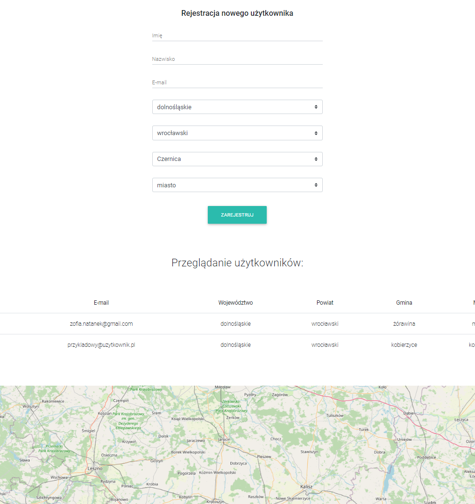

# Geocoding App

Application created to register users, display list of registered users and map with localizations.

## Application interface

## Technologies

- React
- Node.js
- Express.js
- MongoDB
- styled-components

## Setup

In server:
npm install
nodemon index.js

In client:
npm install
npm start

## Demo
https://git.heroku.com/morning-eyrie-15683.git

## Features

- User registration
- Fetching adress data from external API
- Geocoding adress points
- Display adress points on the map

## Sources
API:  https://capap.gugik.gov.pl/
